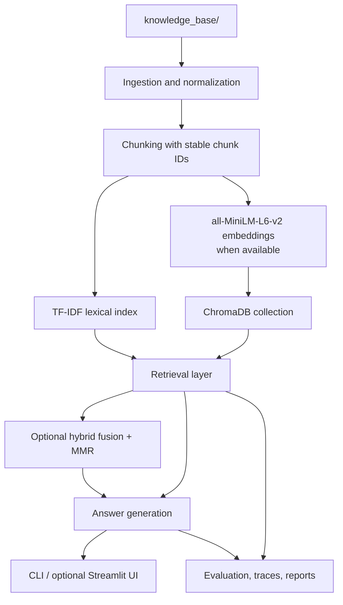

# Prototype RAG FAQ Answering System

This repository contains a prototype Retrieval-Augmented Generation (RAG) FAQ system built for Durham College Natural Language Processing Project 10. It keeps the class-required root `rag_system.py` entrypoint, ChromaDB + MiniLM retrieval path, GPT-4o-mini generation path, and course-scored evaluation deliverables, while also adding a clean canonical benchmark file, a stronger portfolio-oriented hybrid retrieval mode, offline-safe execution, and a small optional Streamlit interface.

See [SYSTEM_CARD.md](SYSTEM_CARD.md) for a concise overview of intended use, limits, evaluation scope, and failure modes.

## Why RAG Is Useful

RAG is useful for grounded question answering because it separates retrieval from generation. Instead of answering from model memory alone, the system first retrieves relevant chunks from a local knowledge base and then answers from those chunks. That makes source attribution possible, reduces unsupported claims, and creates a more inspectable workflow for an academic FAQ setting.

## Architecture



## Course-Compliant Mode

The course-compliant path is centered on the required root CLI and the explicit Chroma workflow:

- `rag_system.py` remains the root entrypoint.
- `knowledge_base/` stays at the repository root.
- the dense path uses `sentence-transformers/all-MiniLM-L6-v2`
- the vector store path uses ChromaDB with `collection.add(...)` and `collection.query(...)`
- the OpenAI path uses `gpt-4o-mini` when `OPENAI_API_KEY` is available

The primary submission-facing command surface kept at the repository root is:

```bash
python rag_system.py --build-index
python rag_system.py --ask "What is self-attention?"
python rag_system.py --ask "What is self-attention?" --offline
python rag_system.py --evaluate
python rag_system.py --smoke-test --offline
```

Equivalent subcommands such as `build`, `ask`, `evaluate`, and `demo` remain supported for explicit or advanced usage.

When the full stack is available locally, the intended dense course flow is:

```bash
python rag_system.py --build-index --backend chroma --rebuild
python rag_system.py --ask "What is self-attention?" --backend chroma --llm openai
```

## Resume-Impressive Hybrid Mode

The portfolio-oriented path adds a stronger retrieval mode without removing the class-required flow:

- `--backend hybrid` combines lexical and dense retrieval
- reciprocal rank fusion merges candidate rankings
- lightweight MMR reduces near-duplicate final chunks
- retrieval traces can be written to JSON for inspection
- the same CLI can also drive the optional Streamlit demo

Example hybrid command:

```bash
python rag_system.py --ask "How does attention help transformers?" --backend hybrid --offline
```

## Offline Fallback Mode

The offline fallback path is the safest local mode for an M1 MacBook Pro:

- `--backend tfidf` uses pure-Python lexical retrieval
- `--llm offline` uses extractive grounded answer generation with citations
- `--backend auto --llm auto` falls back to the local path when dense dependencies, cached models, or API keys are unavailable

Offline-safe commands:

```bash
python rag_system.py inspect-kb
python rag_system.py --build-index --backend tfidf
python rag_system.py --ask "What is self-attention?" --backend tfidf --offline
python rag_system.py --evaluate --backend tfidf --offline
python rag_system.py --smoke-test --offline
```

## M1 Mac Setup

The project is designed to run in a lightweight mode first, then opt into the full dense/OpenAI stack only when needed.

### Lite Setup

```bash
make setup-lite
python scripts/preflight_m1.py
```

Lite mode is the recommended first run on an M1 Mac because it:

- does not require `OPENAI_API_KEY`
- does not require ChromaDB
- does not require `sentence-transformers`
- does not require model downloads

### Full Setup

```bash
make setup-full
python scripts/preflight_m1.py
```

Full setup installs the complete project stack. The dense path may still require a locally cached MiniLM model before `--backend chroma` or `--backend hybrid` can run successfully.

## CI / Reproducibility

The repository includes an offline validation workflow at `.github/workflows/offline-ci.yml`.
It validates the clean-clone offline path using only `requirements-lite.txt` and runs:

```bash
make smoke
make test
python scripts/audit_submission.py
```

This workflow does not require `OPENAI_API_KEY`, ChromaDB, `sentence-transformers`, or model downloads.

## Optional GPT-4o-mini Live Validation

The repository includes a small validation script for the GPT-4o-mini generation path:

```bash
python scripts/validate_openai_path.py
make validate-openai
```

By default, this script does not call OpenAI. It writes `results/openai_validation_summary.json` and records a skip status instead:

- `skipped_no_api_key` when `OPENAI_API_KEY` is absent
- `skipped_run_live_not_requested` when a key exists but live validation was not explicitly requested
- `skipped_openai_sdk_unavailable` when `--run-live` was requested without the OpenAI SDK available locally

To run the optional live validation on three fixed questions, opt in explicitly:

```bash
python scripts/validate_openai_path.py --run-live
make validate-openai RUN_LIVE=1
```

This live check exercises the GPT-4o-mini generation path through the local TF-IDF retrieval flow so it does not depend on ChromaDB or MiniLM. It may still require the full Python environment with the OpenAI SDK installed.

## Commands To Run

### Submission-Facing CLI

```bash
python rag_system.py --build-index
python rag_system.py --ask "What is self-attention?"
python rag_system.py --ask "What is self-attention?" --offline
python rag_system.py --evaluate
python rag_system.py --smoke-test --offline
```

### Equivalent Explicit Modes

```bash
python rag_system.py --build-index --backend tfidf
python rag_system.py --ask "What is self-attention?" --backend tfidf --offline
python rag_system.py --ask "What is self-attention?" --backend auto --llm auto
python rag_system.py --evaluate --backend tfidf --offline
python rag_system.py inspect-kb
python scripts/run_backend_comparison.py --offline-only
python scripts/run_backend_comparison.py --include-openai
python scripts/validate_openai_path.py
python rag_system.py demo --backend tfidf --llm offline
```

### Optional Streamlit Interface

The Streamlit UI is documented on purpose as a second local usage story, but it remains optional and is not required for tests, smoke runs, or submission. The app defaults to the offline-safe `tfidf` + `offline` path and surfaces fallback/runtime warnings so it can work as a resume demo without changing the course-facing CLI workflow.

```bash
pip install streamlit
streamlit run app.py
```

The UI lets you:

- enter a question
- choose `auto`, `tfidf`, `chroma`, or `hybrid`
- choose `auto`, `offline`, or `openai`
- inspect answer text, sources, retrieved context, and retrieval trace
- see the backend actually used, LLM mode actually used, latency, and confidence / abstention diagnostics
- see clear warnings when dense or OpenAI dependencies are unavailable

Optional demo notes:

- Walkthrough: [docs/demo_walkthrough.md](docs/demo_walkthrough.md)
- Screenshot instructions: [screenshots/README.md](screenshots/README.md)

## Example Output

Example CLI output from the offline-safe path:

```text
ANSWER
Self attention lets tokens in the same sequence compare with one another so each token representation can incorporate broader context. [1]

SOURCES
[1] faq_attention_003 | attention | knowledge_base/faqs.csv | 0
[2] faq_attention_006 | attention | knowledge_base/faqs.csv | 0
[3] self_attention_and_transformer_architecture | attention | knowledge_base/docs/self_attention_and_transformer_architecture.md | 0
```

## Evaluation Results

The evaluation workflow now separates the stable benchmark from generated outputs:

- `evaluation_questions.csv` is the canonical clean benchmark source.
- `test_questions.csv` is rewritten by evaluation as the course-compliant scored CSV.
- `results/test_questions_scored.csv` stores the richer scored output with runtime metadata.

The latest scored offline evaluation artifacts are in `results/`. The current aggregate metrics from `results/evaluation_summary.json` are:

| Metric | Value |
| --- | ---: |
| Questions | 30 |
| Answerable questions | 24 |
| Out-of-scope questions | 6 |
| Retrieval Recall@3 | 0.88 |
| MRR@3 | 0.69 |
| Faithfulness | 0.91 |
| Citation validity rate | 1.00 |
| Abstention accuracy (unanswerable) | 1.00 |
| Average latency (ms) | 1.51 |
| Median latency (ms) | 1.40 |
These numbers come from the validated offline run:

```bash
python rag_system.py --evaluate --backend tfidf --offline
```

That command reads only from `evaluation_questions.csv` and does not mutate the benchmark file.

### Backend Comparison

<!-- backend-comparison:start -->
Auto-generated from real comparison artifacts under `results/comparisons/backend_comparison_summary.json` and `results/comparisons/backend_comparison_table.md`.
Latest comparison run: `2026-04-20T14:57:16.089471+00:00`.

| Configuration | Status | Requested Backend | Requested LLM | Resolved Backend | Resolved LLM | Questions | Answerable | Unanswerable | Recall@3 | MRR@3 | Faithfulness | Citation Validity | Abstention Accuracy | False Abstention | Avg Latency (ms) | Reason |
| --- | --- | --- | --- | --- | --- | ---: | ---: | ---: | ---: | ---: | ---: | ---: | ---: | ---: | ---: | --- |
| tfidf + offline | success | tfidf | offline | tfidf | offline | 30 | 24 | 6 | 0.88 | 0.69 | 0.91 | 1.00 | 1.00 | 0.00 | 1.57 | n/a |
| auto + offline | success | auto | offline | tfidf | offline | 30 | 24 | 6 | 0.88 | 0.69 | 0.91 | 1.00 | 1.00 | 0.00 | 1.74 | n/a |
| chroma + offline | skipped | chroma | offline | n/a | n/a | n/a | n/a | n/a | n/a | n/a | n/a | n/a | n/a | n/a | n/a | dense retrieval unavailable: chromadb unavailable: ModuleNotFoundError: No module named 'chromadb' |
| hybrid + offline | skipped | hybrid | offline | n/a | n/a | n/a | n/a | n/a | n/a | n/a | n/a | n/a | n/a | n/a | n/a | dense retrieval unavailable: chromadb unavailable: ModuleNotFoundError: No module named 'chromadb' |
| chroma + openai | skipped | chroma | openai | n/a | n/a | n/a | n/a | n/a | n/a | n/a | n/a | n/a | n/a | n/a | n/a | openai sdk unavailable: ModuleNotFoundError: No module named 'openai' |
| hybrid + openai | skipped | hybrid | openai | n/a | n/a | n/a | n/a | n/a | n/a | n/a | n/a | n/a | n/a | n/a | n/a | openai sdk unavailable: ModuleNotFoundError: No module named 'openai' |
<!-- backend-comparison:end -->

## Limitations

This repository is a prototype, not a production-ready RAG system.

- offline generation is extractive and can still over-answer when retrieval is loosely related
- hybrid and Chroma modes depend on optional dense dependencies and local MiniLM availability
- abstention quality still depends on retrieval quality and may degrade on loosely related out-of-scope prompts beyond the benchmark
- multi-hop retrieval remains the weakest part of the evaluation set
- the knowledge base is curated for course topics, not open-domain coverage

## File Structure

```text
.
├── rag_system.py
├── app.py
├── README.md
├── PROJECT_REPORT.md
├── SYSTEM_CARD.md
├── SUBMISSION_CHECKLIST.md
├── evaluation_questions.csv
├── failure_case_report.md
├── docs/demo_walkthrough.md
├── knowledge_base/
│   ├── faqs.csv
│   └── docs/
├── screenshots/README.md
├── results/
│   ├── demo_run.md
│   ├── evaluation_report.md
│   ├── evaluation_summary.json
│   ├── openai_validation_summary.json
│   └── test_questions_scored.csv
├── src/ragfaq/
├── test_questions.csv
└── tests/
```
